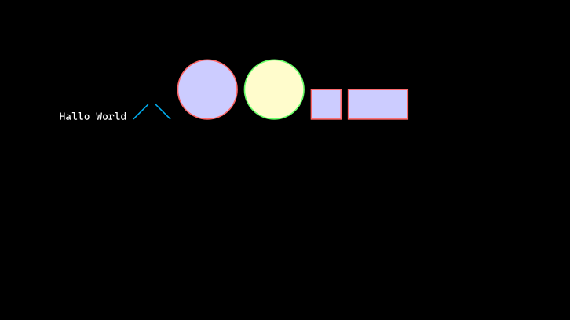
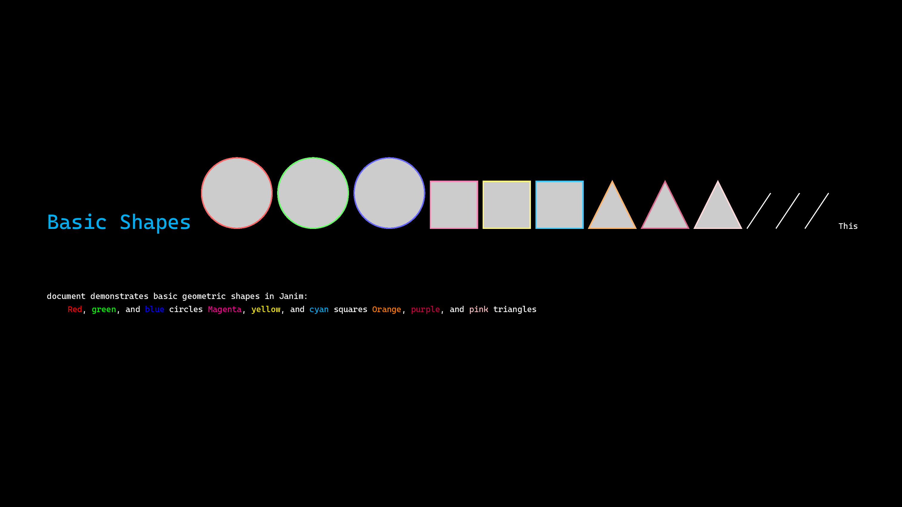

# Janim

Janim is a Maths animation library inspired by Manim.

## Features

Current features include:

- Drawing basic shapes (circles, squares, rectangles, triangles, ovals)
- Customizable colors and fill percentages
- Creating LaTeX documents with TikZ
- Setting page properties (color, orientation, dimensions)
- Text rendering
- Document creation and finalization
- Rendering documents to PDF
- Custom title page creation with janim_make_title (sets title, author, and date automatically)
- Automatic layout and drawing of automata from a simple description language

## TODO

Potential future improvements:

- [ ] Add more shapes (arrows, polygons, etc.)
- [ ] Implement animation capabilities
- [ ] Add support for gradients and patterns
- [ ] Include transformation functions (rotation, scaling)
- [ ] Add text styling options (font size, bold, italic)
- [ ] Implement grouping of objects
- [ ] Add support for Bezier curves
- [ ] Include pre-defined color palettes
- [ ] Add command-line arguments for rendering options
- [ ] Improve error handling and input validation
- [ ] Add support for automatic layout of mathematical diagrams
- [ ] Implement more sophisticated text formatting with LaTeX math mode
- [ ] Add support for 3D shapes and scenes
- [ ] Implement a GUI for creating animations
- [ ] Add audio support for animations

## Installation

Prerequisites: g++, texlive, texlive-latex-extra, texlive-luatex

```bash
sudo apt-get install build-essential texlive texlive-latex-extra texlive-luatex
```

To install Janim using CMake, follow these steps:

1. Clone the repository:
   ```
   git clone https://github.com/JanDalhuysen/janim.git
   ```
2. Navigate to the project directory:
   ```
   cd janim
   ```
3. Create a build directory and navigate into it:
   ```
   mkdir build && cd build
   ```
4. Run CMake to configure the project:
   ```
   cmake ..
   ```
5. Compile the project:
   ```
   cmake --build .
   ```

## Usage

Here is an example of how to use the Janim library:

```cpp
#include <iostream>
#include <string>

#include "janim.hpp"

using namespace std;

int main()
{
    // Janim version
    cout << janim_version << endl;

    janim_set_mode("Document");
    janim_set_page_color("black");
    janim_set_page_orientation("Landscape");

    janim_set_page_height("108mm");
    janim_set_page_width("192mm");

    janim_set_main_font("CascadiaMono.ttf");

    janim_create_document();

    janim_text("Hallo World");

    janim_line("0mm", "0mm", "5mm", "5mm", "cyan");
    janim_line("0mm", "5mm", "5mm", "0mm", "cyan");

    janim_circle("10mm", "10mm", "10mm", "red", "60", "blue", "20");
    janim_circle("10mm", "10mm", "10mm", "green", "60", "yellow", "20");

    janim_square("10mm", "10mm", "10mm", "red", "60", "blue", "20");

    janim_rectangle("10mm", "10mm", "20mm", "10mm", "red", "60", "blue", "20");

    janim_end_document();
    janim_render();
}
```



Another example:

```cpp

// Janim Example 1: Basic Document and Shapes
// This example demonstrates creating a document with basic geometric shapes

#include <iostream>
#include <string>
#include "janim.hpp"

using namespace std;

int main()
{
    cout << janim_version << endl;

    // Set up document properties
    janim_set_mode("Document");
    janim_set_page_color("black");
    janim_set_page_orientation("Landscape");
    janim_make_title("Janim Example 1", "Basic Shapes and Layout", "John Doe");
    janim_set_page_height("216mm");
    janim_set_page_width("384mm");
    janim_set_main_font("CascadiaMono.ttf");

    // Create document
    janim_create_document();

    // Add title text
    janim_text("\\Huge \\textcolor{cyan}{Basic Shapes}");
    janim_text("\\vspace{5mm}"); // Add some vertical space

    // Draw a grid of shapes
    // Circles
    janim_circle("20mm", "40mm", "15mm", "red");
    janim_circle("60mm", "40mm", "15mm", "green");
    janim_circle("100mm", "40mm", "15mm", "blue");

    // Squares
    janim_square("20mm", "80mm", "20mm", "magenta");
    janim_square("60mm", "80mm", "20mm", "yellow");
    janim_square("100mm", "80mm", "20mm", "cyan");

    // Triangles
    janim_triangle("30mm", "120mm", "20mm", "orange");
    janim_triangle("70mm", "120mm", "20mm", "purple");
    janim_triangle("110mm", "120mm", "20mm", "pink");

    // Lines connecting shapes
    janim_line("35mm", "55mm", "45mm", "70mm", "white", "thick");
    janim_line("75mm", "55mm", "85mm", "70mm", "white", "thick");
    janim_line("115mm", "55mm", "125mm", "70mm", "white", "thick");

    // Add descriptive text
    janim_text("\\vspace{20mm}");
    janim_text("\\textcolor{white}{This document demonstrates basic geometric shapes in Janim:}");
    janim_text("\\begin{itemize}");
    janim_text("\\item \\textcolor{red}{Red}, \\textcolor{green}{green}, and \\textcolor{blue}{blue} circles");
    janim_text("\\item \\textcolor{magenta}{Magenta}, \\textcolor{yellow}{yellow}, and \\textcolor{cyan}{cyan} squares");
    janim_text("\\item \\textcolor{orange}{Orange}, \\textcolor{purple}{purple}, and \\textcolor{pink}{pink} triangles");
    janim_text("\\end{itemize}");

    // Finalize document
    janim_end_document();
    janim_render();

    return 0;
}
```


